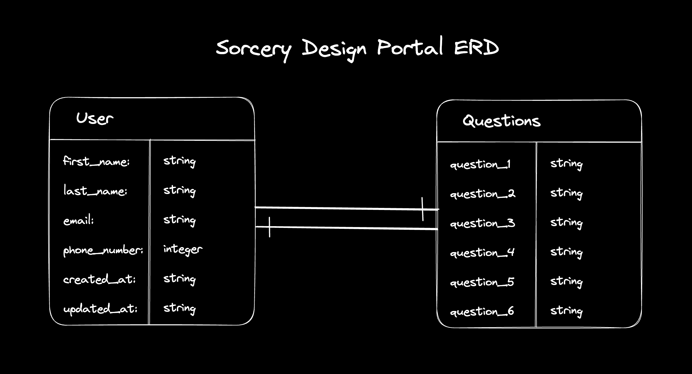

# Sorcery Portal

## Aim

To build a user portal space that can be used by clients of Sorcery Design to upload their answers to Sorcery Design's question for fact finding to work on branding and marketing for the client.

## Who is the client

Sorcery Design

We're a design agency that specialises in enabling ethical entrepreneurs and organisations who make a difference to thrive in the digital realm. Because, what really matters to us is having a meaningful impact in meaningful work.

We get it: choosing the right creative partner to help you take your life's work to the next level is a challenge. But, with our combined 22 years of experience in branding, design, digital marketing, building websites and generating engaged advocates - we can help you craft the business of your dreams.

## The Plan

Through talking with the client we have decided that sorcery design needs a user space where clients of sorcery design, once signed up to working with them can then work through a series of questions and information gathering which sorcery design can then use to make and design the clients new identity system and website.

This will consist of a sign in portal which the user can sign up to and questions, and if enough time a image upload facility for creating a mood board space (stretch goal). Once the client has finished the questions the answers will be stored into sorcery design's database (rails) and the user will receive a conformation email to say they have been received (stretch goal), and Sorcery design will be emailed the responses form the client (stretch goal).

## User Stories

- As a user I want to be able to create an account/profile on sorcery portal
- As a user I want to be able to delete my profile
- As a user I want to be able to edit my profile information
- As a user I want to be able to answer the questions and information gathering
- As a user I want to be able to edit the answers and information gathering
- As a user I want to be able to view the answers to questions and information gathering
- As a user I want to be able to delete the answers and information gathering
- As a user I want to be able to send sorcery design my answers so they can create my logo/identity system

## User Stories (stretch goals)

- As a user I want to be able to upload pictures to my mood board in the portal
- As a user I want to be able to send the mood board to sorcery design
- As a user I want to be able to add colours I like to a pallete for sorcery design to use in my new logo/identity system
- As a user I want to be receive a confirmation email that my information has been sent to sorcery design.

## Entity Relationship Diagram

